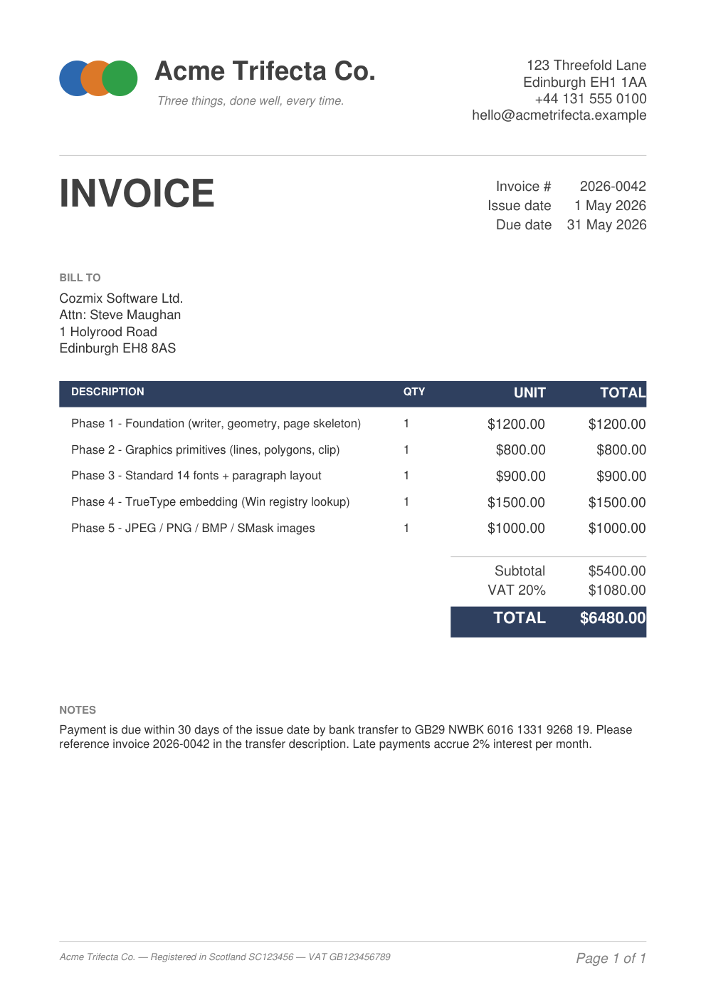
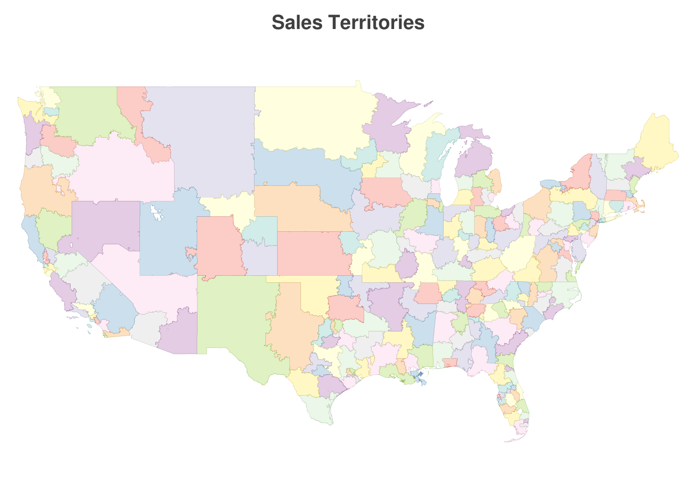
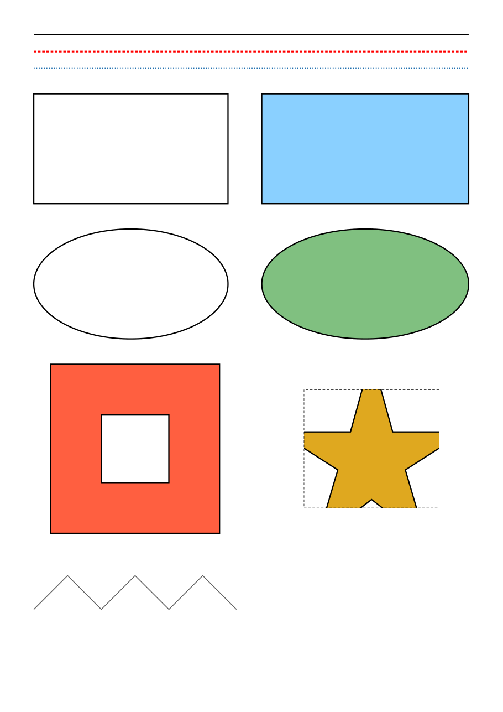
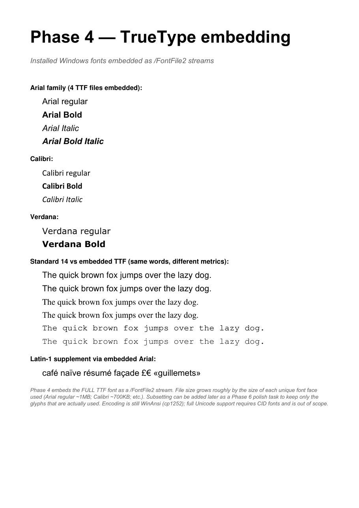
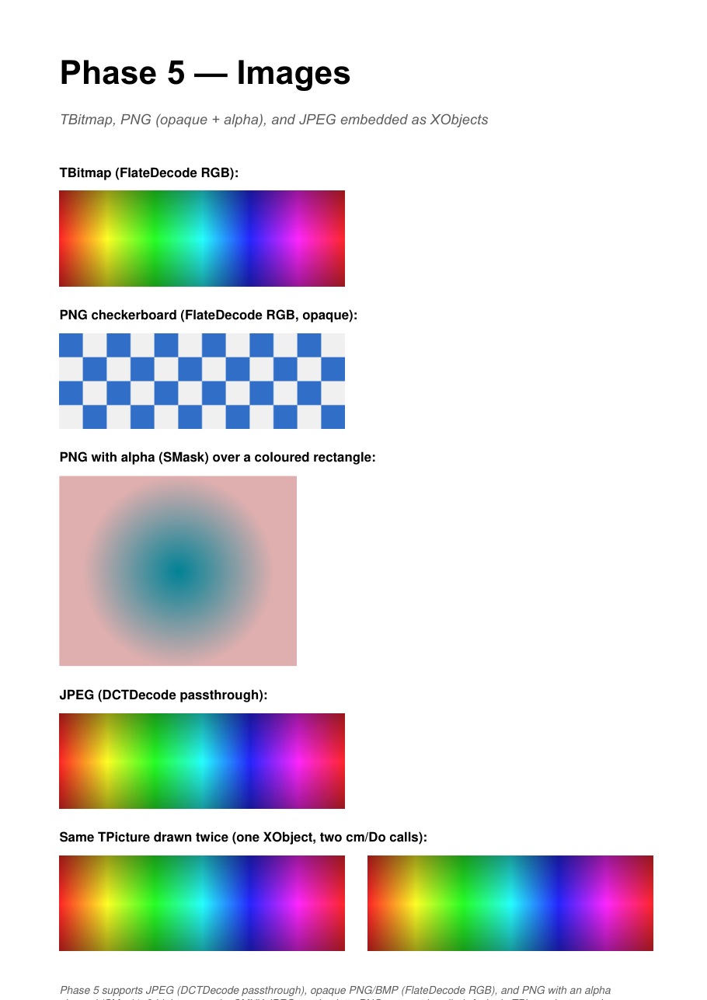
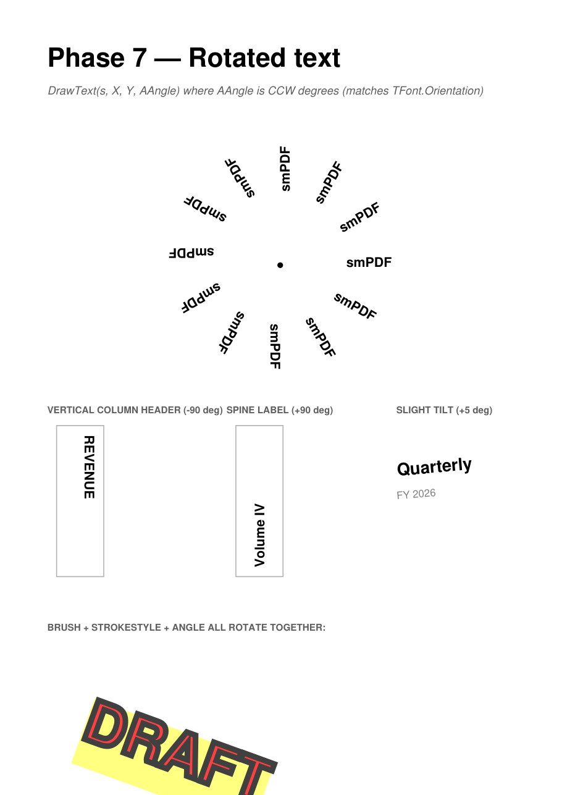

# smPDF — pure-Pascal PDF export library for Delphi


A self-contained library for generating PDF files from Delphi 10.1 Berlin or
newer, on Win32 and Win64. No third-party dependencies; the library writes
PDF 1.4 bytes directly.

## At a glance

```pascal
uses
  Vcl.Graphics, smPDF;

var
  pdf: TsmPDF;
begin
  pdf := TsmPDF.Create;
  try
    pdf.NewPage(psA4, poPortrait, 72);

    pdf.Font.Name := 'Arial';
    pdf.Font.Size := 24;
    pdf.Font.Bold := True;
    pdf.DrawText('Hello, PDF! Łódź, Győr, Hà Nội', 50, 50);

    pdf.Pen.Color := clBlue;
    pdf.Pen.Width := 1.5;
    pdf.DrawLine(50, 100, 545, 100);

    pdf.Save('hello.pdf');
  finally
    pdf.Free;
  end;
end;
```

## What it does

- **PDF 1.4 export**: no reading, parsing or editing
- **Graphics**: lines, boxes, rounded rectangles, ovals, polylines, polygons and
  poly-polygons with holes (even-odd or non-zero fill), general Bézier paths,
  a clip-rectangle stack
- **Text**: the 14 standard PDF fonts, plus any installed Windows TrueType font,
  found through GDI (`.ttf`, `.ttc` collections, per-user fonts), **subset** and
  embedded as a CID font. Latin with every accent, Greek, Cyrillic, Chinese,
  Japanese, Korean, Vietnamese and symbol/icon fonts all work, and the text
  stays searchable and copyable
- **Map labels**: GDI-compatible metrics (`TextOrigin = toGdiTop`), halos drawn
  under the fill, text drawn as vector outlines (`DrawTextOutlines`, for icon
  fonts such as Ionicons), rotation at any angle, fallback fonts for
  characters the main font lacks
- **Transparency**: `Opacity` on Pen, Brush and Font
- **Layout**: `DrawText` at a point or fitted to a rectangle, `DrawParagraph`
  with word wrap (breaks between CJK characters too), underline, text
  background
- **Measurement**: `TextWidth[F]`, `TextHeight[F]`, `TextExtent[F]`,
  `MeasureParagraph`, `FontMetrics`
- **Images**: JPEG (passthrough as `DCTDecode`), PNG (opaque, or alpha via
  SMask), BMP and any other `TGraphic`
- **Output**: Flate-compressed, streamed to a file or any `TStream`, or
  returned as `TBytes`; `/Info` metadata; warnings for every fallback
- **Fast**: a page with a million polygon vertices and 2,000 labels builds and
  saves in well under a second

## Gallery

The images below are rendered from PDFs the bundled demos export, with no
post-processing and no third-party tools beyond `mutool` for the screenshot.

<table>
  <tr>
    <td width="50%" valign="top">
      <a href="images/invoice.png"></a>
      <p><b>Standalone invoice</b> — text alignment, paragraphs, table headers, ovals as a logo, custom RGB throughout, and a tiled <code>PAID</code> watermark at 45°. Standard 14 fonts only. Source: <a href="Demos/Invoice/"><code>Demos/Invoice/</code></a>.</p>
    </td>
    <td width="50%" valign="top">
      <a href="images/map.png"></a>
      <p><b>A3 sales-territory map</b> — 237 territories (525,000 vertices) projected from a 74 MB GeoJSON via Mercator and drawn with <code>DrawPolyPolygon</code>. Source: <a href="Demos/Map/"><code>Demos/Map/</code></a>.</p>
    </td>
  </tr>
  <tr>
    <td width="50%" valign="top">
      <a href="images/showcase-primitives.png"></a>
      <p><b>Graphics primitives</b> — pen styles (solid/dash/dot), line widths, filled and outlined boxes/ovals, polygons-with-holes, polygon clipped to a rectangle, open polylines. From the showcase.</p>
    </td>
    <td width="50%" valign="top">
      <a href="images/showcase-fonts.png"></a>
      <p><b>Embedded TrueType</b> — Arial / Calibri / Verdana subset and embedded, side by side with the Standard 14.</p>
    </td>
  </tr>
  <tr>
    <td width="50%" valign="top">
      <a href="images/showcase-images.png"></a>
      <p><b>Embedded images</b> — TBitmap (FlateDecode RGB), PNG (opaque + alpha via SMask), JPEG (DCTDecode passthrough). Same TPicture drawn twice de-dupes to a single XObject.</p>
    </td>
    <td width="50%" valign="top">
      <a href="images/showcase-rotation.png"></a>
      <p><b>Rotated text</b> — <code>DrawText(s, X, Y, AAngle)</code> with CCW degrees. Compass rose, vertical column header, book-spine label, and a styled diagonal "DRAFT" watermark.</p>
    </td>
  </tr>
</table>

Page 8 of the showcase (`build.ps1`) shows the 2.0 features: text in seven
scripts, a clipped mini-map with halo labels and Ionicons rep icons, and label
stacks measured with GDI metrics. Regenerate the gallery with
[`images/regenerate.ps1`](images/regenerate.ps1) (needs `mutool`:
`winget install ArtifexSoftware.mutool`).

## Coordinate system

- **Units**: pixels at the page's DPI. `NewPage(psA4, poPortrait, 300)` makes a
  300 DPI page; `NewPage(AWidthPt, AHeightPt)` takes the page size in **points**
  and defaults to **72 DPI, where one pixel is one point**. To work in points,
  as AlignMix does, use a 72 DPI page and pass points everywhere.
- **Precision**: coordinates are `Double` (every drawing method has a `Double`
  overload; the `Integer` ones remain). They are written with three decimals by
  default; `CoordinatePrecision := 1` writes 0.1 pt, still invisible in print,
  and roughly halves the size of polygon-heavy pages.
- **Origin**: top-left, Y grows downward, as in `TCanvas`. `Y = 0` is the top
  edge of the page and `Y = Height` the bottom edge; the flip to PDF's
  bottom-left origin happens on output.
- **Page size**: the MediaBox is the exact point size (A4 is 595.28 × 841.89).
- **Font sizes and pen widths** are in points.

```pascal
pdf.NewPage(2383.94, 3370.39);      // A0 portrait, 72 DPI: pixels are points
pdf.DrawLine(10.25, 20.5, 300.75, 20.5);
pdf.Font.Size := 7.35;              // fractional sizes are written as given
```

## Public API

Everything is in `uses smPDF`. Types:

| Type | Purpose |
|---|---|
| `TsmPDF` | The document: pages, drawing, text, measurement, saving |
| `TPDFFont` | `Name`, `Size` (`Double`), `Color`, `Bold`, `Italics`, `Underline`, `StrokeColor`, `StrokeStyle`, `StrokeWidth`, `StrokeMode`, `Opacity`, `FallbackFonts` |
| `TPDFPen` | `Color`, `Width`, `Style` (penSolid/Dash/Dot/DashDot/None), `LineCap`, `LineJoin`, `Opacity` |
| `TPDFBrush` | `Color`, `Style` (brushSolid / brushClear), `Opacity`. When solid, also paints a background behind `DrawText` / `DrawParagraph` |
| `TPDFFillRule` | `frEvenOdd`, `frNonZero` |
| `TPDFTextOrigin` | `toTypoTop`, `toGdiTop`, `toBaseline` — what the Y of `DrawText(X, Y)` means |
| `TPDFStrokeMode` | `smOverFill`, `smUnderFill` — outline over the glyphs, or a halo under them |
| `TPDFTextMetrics` | `Ascent`, `Descent`, `LineHeight`, `CapHeight`, `XHeight` (page pixels) |
| `TPDFPointList` / `TPDFPointFList` | `TList<TPoint>` / `TList<TPointF>` |
| `TPDFOrientation`, `TPDFPaperSize`, `TPDFPenStyle`, `TPDFBrushStyle`, `TPDFTextPadding`, `TPDFStrokeStyle`, `TPDFLineCap`, `TPDFLineJoin` | as their names say |
| `EPDFError` | The single exception class the library raises |
| `SystemFallbackFonts(Family)` | A ready-made value for `Font.FallbackFonts` |

Pages and output:

```pascal
procedure NewPage(const APaperSize: TPDFPaperSize; const AOrientation: TPDFOrientation;
                  const ADPI: Integer = 300; const APaperColor: TColor = clWhite;
                  const AWidth: Integer = 0; const AHeight: Integer = 0); overload;  // psCustom: pixels
procedure NewPage(const AWidthPt, AHeightPt: Double; const ADPI: Integer = 72;
                  const APaperColor: TColor = clWhite); overload;
procedure NewPage; overload;                   // same size as the previous page (A4 at first)

function Save(const AFileName: string): Int64; overload;     // bytes written
function Save(AStream: TStream): Int64; overload;            // writes at AStream.Position
function ToBytes: TBytes;
```

`Save(FileName)` streams through a buffered file stream and `Save(Stream)`
writes straight to the stream, so neither holds a second copy of the document.

Drawing:

```pascal
procedure DrawLine(x1, y1, x2, y2);             // Integer and Double overloads
procedure DrawBox(x1, y1, x2, y2);
procedure DrawOval(x1, y1, x2, y2);
procedure DrawRoundRect(const R: TRectF; ARadiusX, ARadiusY: Double);
procedure DrawMultiLine(const APointList: TPDFPointList | TPDFPointFList);
procedure DrawPolyline(const APoints: array of TPointF; ACount: Integer = -1);
procedure DrawPolyPolygon(const APoints: array of TPointF | TPoint;
                          const ACounts: array of Integer; AFillRule: TPDFFillRule = frEvenOdd);
procedure DrawPolygon(const APointList: TPDFPointList | TPDFPointFList); overload;
procedure DrawPolygon(const APointList; AClipRect: TRect | TRectF); overload;
procedure DrawPicture(const APicture: TPicture; ARect: TRect | TRectF;
                      AAlignment: TAlignment = taLeftJustify; AStretch: Boolean = False);
procedure DrawPicture(const APicture: TPicture; x1, y1: Integer);

procedure PushClipRect(const R: TRectF | TRect);
procedure PopClip;

procedure BeginPath;
procedure MoveTo(X, Y: Double);
procedure LineTo(X, Y: Double);
procedure CurveTo(X1, Y1, X2, Y2, X3, Y3: Double);
procedure ClosePath;
procedure FillPath(AFillRule: TPDFFillRule = frNonZero);
procedure StrokePath;
procedure FillAndStrokePath(AFillRule: TPDFFillRule = frNonZero);
```

Text:

```pascal
procedure DrawText(const AText: string; X, Y: Integer | Double; AAngle: Double = 0);
procedure DrawText(const AText: string; ARect: TRect; AAlignment: TAlignment = taLeftJustify);
procedure DrawParagraph(const AText: string; ARect: TRect; AAlignment: TAlignment;
                        APadding: TPDFTextPadding);
procedure DrawTextOutlines(const AText: string; X, Y: Double; AAngle: Double = 0);

function TextWidth / TextHeight (const AText: string): Integer;
function TextWidthF / TextHeightF (const AText: string): Double;
function TextExtent(const AText: string): TSize;
function TextExtentF(const AText: string): TSizeF;
function MeasureParagraph(const AText: string; AMaxWidthPx: Integer;
                          APadding: TPDFTextPadding = tpSingle): TSize;
function FontMetrics: TPDFTextMetrics;
```

> **`DrawText(s, Rect)` fits the font size to the rectangle.** It picks the
> largest size at which the text fits the rectangle's width and height and
> ignores `Font.Size`. It is not VCL `TCanvas.TextRect`, which clips at the
> current size. To draw at `Font.Size` inside a box, measure with `TextWidthF`
> and call `DrawText(s, X, Y)`, inside `PushClipRect` if it must be clipped.

Properties: `Font`, `Pen`, `Brush`, `TextOrigin`, `CompressStreams` (default
`True`), `CoordinatePrecision` (default 3), `Title`, `Author`, `Subject`,
`Creator`, `Producer`, `CreationDate`, and read-only `Warnings`, `Width`,
`Height` (pixels), `WidthPt`, `HeightPt`, `DPI`, `Size`, `Orientation`,
`PaperColor`. `PageCount` returns the number of pages.

## Polygons, holes and fill rules

`DrawPolyPolygon` takes all the points in one array and the number of points in
each ring, so ring boundaries never depend on coordinates. Rings are closed
automatically. With `frEvenOdd` (the default) nested rings become holes; with
`frNonZero` holes need the opposite winding. The arrays are open arrays, so
existing buffers are passed without copying.

```pascal
// A square with a square hole
pdf.Brush.Style := brushSolid;
pdf.DrawPolyPolygon(
  [PointF(60, 430), PointF(260, 430), PointF(260, 630), PointF(60, 630),     // outer
   PointF(120, 490), PointF(200, 490), PointF(200, 570), PointF(120, 570)],  // hole
  [4, 4]);
```

The older `DrawPolygon(TPDFPointList)` still works. It starts a new ring when a
point repeats the start of the current ring, so a ring that passes through its
own start point is split. Prefer `DrawPolyPolygon` for real geography.

## Clipping and paths

```pascal
pdf.PushClipRect(TRectF.Create(36, 126, 3334, 2348));   // the map frame
// ... everything drawn here is clipped ...
pdf.PopClip;
```

Clips nest (each one intersects the previous) and belong to their page; any
still open when the page is written are closed automatically.

The path API draws arbitrary shapes with the current Pen and Brush:

```pascal
pdf.BeginPath;
pdf.MoveTo(100, 100);
pdf.CurveTo(150, 50, 250, 150, 300, 100);
pdf.LineTo(300, 200);
pdf.ClosePath;
pdf.FillAndStrokePath;
```

Any other drawing, clipping, `NewPage` or `Save` while a path is open raises
`EPDFError`. `DrawRoundRect` is built from the same curves; a zero radius draws
exactly what `DrawBox` draws.

## Text for maps

**Where the text sits.** `TextOrigin` decides what the Y of `DrawText(X, Y)`
means:

| `TextOrigin` | Y is | `TextHeight` is |
|---|---|---|
| `toTypoTop` (default) | top of the typographic ascent | 1.2 × size |
| `toGdiTop` | top of GDI's character cell: the baseline is at `Y + usWinAscent` | `usWinAscent + usWinDescent`, GDI's cell height |
| `toBaseline` | the baseline | 1.2 × size |

Use `toGdiTop` to measure and stack labels exactly as `TCanvas.TextOut` does,
so a PDF export matches a GDI-rendered PNG. `FontMetrics` returns the ascent,
descent, line height, cap height and x-height for the current font, size and
origin.

**Halos.** `Font.StrokeWidth` (points) outlines the text in
`Font.StrokeColor`. With `Font.StrokeMode := smUnderFill` the outline is
stroked first, at twice the width with round joins, and the text is filled on
top, so `StrokeWidth` of halo shows around each glyph without thinning it:

```pascal
pdf.Font.Color       := clBlack;
pdf.Font.StrokeColor := clWhite;
pdf.Font.StrokeWidth := 0.6;
pdf.Font.StrokeMode  := smUnderFill;
pdf.DrawText('Worcester', X, Y);
```

`smOverFill` (the default) strokes on top of the fill. The older
`Font.StrokeStyle` (`ssThin` / `ssMedium` / `ssThick`) still works and gives a
width proportional to the font size; `StrokeWidth > 0` overrides it.

**Text as outlines.** `DrawTextOutlines` draws the glyphs as filled vector
paths taken from the font through GDI, rather than as PDF text. Use it for icon
fonts (AlignMix draws its rep icons from Ionicons at U+F202 and U+F25D) and for
fonts that may not be embedded. It honours `Font.Color`, halos, rotation and
`TextOrigin`, and caches each glyph's outline per document.

```pascal
pdf.Font.Name := 'Ionicons';
pdf.Font.Size := 14;
pdf.DrawTextOutlines(#$F202, X, Y);
```

**Rotation.** `DrawText(s, X, Y, AAngle)` and `DrawTextOutlines` rotate
counter-clockwise by `AAngle` degrees around `(X, Y)`, together with the
background, underline and outline.

**Background and underline.** When `Brush.Style = brushSolid`, `DrawText` and
`DrawParagraph` paint `Brush.Color` behind the text (the text cell for the
point overload, the rectangle for the others). `Font.Underline` draws a line
about 0.12 em below the baseline.

## Fonts

If `Font.Name` is one of the 14 standard PDF fonts (`Helvetica`, `Times`,
`Courier`, `Symbol`, `ZapfDingbats`, and aliases such as `Sans`, `Serif`,
`Mono`), nothing is embedded and the viewer supplies the font.

Any other name is resolved **through GDI**, exactly as `TCanvas` would resolve
`(Name, Bold, Italics)`, so the embedded face is the one Windows draws:
standalone `.ttf` files, members of `.ttc` collections (Cambria, Microsoft
YaHei, Yu Gothic, …) and fonts installed for the current user only. The font is
**subset**, keeping only the glyphs drawn, so a page of Arial adds about 20 KB
rather than 1 MB. It is written as a `Type0` / `CIDFontType2` font with
`Identity-H` encoding and a `ToUnicode` map.

When the family has no bold or italic face, text is emboldened or slanted the
way GDI would do it.

These fall back to Helvetica and add a line to `pdf.Warnings`:

- a family that is not installed;
- a font with PostScript (CFF) outlines, which PDF 1.4 cannot embed as TrueType;
- a font whose licence (OS/2 `fsType`) forbids embedding.

`DrawTextOutlines` can still draw the last two, because it draws outlines
rather than embedding the font.

### Fallback fonts

A label font such as Oswald has no Chinese glyphs. `Font.FallbackFonts` lists
families to use for characters the main font lacks:

```pascal
pdf.Font.Name          := 'Oswald';
pdf.Font.FallbackFonts := 'Microsoft YaHei;Yu Gothic;Malgun Gothic';
pdf.DrawText('Beijing 北京', X, Y);   // "Beijing " in Oswald, "北京" in YaHei
```

The text is split into runs, each drawn in the first font (the main one first)
that has its characters, one after another on the same baseline. Every
measuring function adds the runs up, so `TextWidth`, alignment and wrapping
stay right. `SystemFallbackFonts('Oswald')` returns a sensible list: the fonts
Windows itself links to that family, then Segoe UI, Microsoft YaHei, Yu Gothic,
Malgun Gothic and Nirmala UI. With `FallbackFonts` empty (the default), a
missing character is drawn as the main font's missing-glyph box and warned
about.

## Encoding

Text is Unicode. What can be drawn depends on the font:

- **Embedded TrueType fonts** show any character the font's `cmap` maps
  one-to-one to a glyph: Latin with every accent (Łódź, Győr, Dvořák), Greek,
  Cyrillic, Chinese, Japanese, Korean, Vietnamese with precomposed characters,
  and symbol or private-use glyphs. Characters above U+FFFF (surrogate pairs)
  work when the font has them. The text can be searched and copied in PDF
  viewers.
- **The 14 standard fonts** are WinAnsi (codepage 1252) only. Anything else is
  drawn as `?`. For names from customer data, use a TrueType font such as
  Arial.
- A character the font does not have is drawn as the font's missing-glyph box.

Every such substitution adds one line to `Warnings` per font and character. For
example:

```text
Font "Arial" has no glyph for U+5317 (北); it was drawn as the font's missing-glyph box.
```

Not supported: complex-script shaping (Arabic, Hebrew, Indic, Thai), right-to-
left and bidirectional text, ligatures, kerning and vertical CJK text.
`DrawParagraph` wraps at spaces and between any two CJK characters; it is not
the full Unicode line-breaking algorithm.

In Delphi source files, save non-ASCII literals as UTF-8 **with a BOM**, or
write them as escapes (`#$0141` for `Ł`); a file without a BOM is read as ANSI.

## Transparency

`Pen.Opacity`, `Brush.Opacity` and `Font.Opacity` run from 0 (invisible) to 1
(opaque, the default). Shapes use the Pen's opacity for their outline and the
Brush's for their fill; text uses `Font.Opacity` for its fill and halo.

```pascal
pdf.Font.Size    := 120;
pdf.Font.Color   := clRed;
pdf.Font.Opacity := 0.15;
pdf.DrawText('TRIAL', 150, 500, 30);   // a translucent watermark
pdf.Font.Opacity := 1;
```

## Document information and warnings

```pascal
pdf.Title  := 'District 12 — North East';
pdf.Author := 'AlignMix';
```

`Title`, `Author`, `Subject`, `Creator` and `Producer` (default
`'smPDF ' + SMPDF_VERSION`) are written to the `/Info` dictionary, with
`CreationDate` (default: when the `TsmPDF` was created). After drawing, check
`pdf.Warnings` for fonts and characters that had to be substituted.

## Threading

A `TsmPDF` instance is not thread-safe, but separate instances can run on
separate threads at the same time: fonts are loaded and cached per document,
through a private GDI device context, and there is no global state.

## What's deliberately not here

- **PDF reading, parsing or editing; form filling; digital signatures;
  annotations and links; encryption.** This library exports only.
- **Tagged PDF / PDF/UA / PDF/A.** No accessibility tagging and no archival
  profile.
- **Complex-script shaping and right-to-left text.** See Encoding above.
- **Justified text, kerning, vertical text.** Text is left, centre or right
  aligned.
- **CMYK images, 16-bit PNG, palette-PNG transparency.** Images are 8-bit RGB
  or RGBA.

## Source layout

```text
smPDF/
  Source/
    smPDF.pas              public API (TsmPDF, TPDFFont, TPDFPen, TPDFBrush, EPDFError, enums)
    smPDF.Types.pas        internal records
    smPDF.Geometry.pas     unit conversion, Y flip, number formatting
    smPDF.Buffer.pas       growable byte buffer for content streams
    smPDF.Writer.pas       PDF object writer (dicts, arrays, streams, xref) over any TStream
    smPDF.Page.pas         TPDFPage: content stream, clip stack, resource registries
    smPDF.Fonts.pas        Standard 14 metrics, WinAnsi encoding
    smPDF.TTF.pas          TrueType parser and sfnt assembly
    smPDF.GdiFonts.pas     font loading and glyph outlines through GDI
    smPDF.FontRegistry.pas per-document font resolution, glyph use, text encoding
    smPDF.Subset.pas       TrueType subsetting
    smPDF.FontEmit.pas     Type1 / Type0 / CIDFontType2 / ToUnicode objects
    smPDF.Images.pas       JPEG/PNG/BMP extraction, Flate compression
  Tests/
    smPDF_Tests.dpr        console test runner (Win32 and Win64)
    Source/                test framework and test units
    Bench/                 throughput benchmark
  Demos/
    Showcase/  8-page demo of every feature (build.ps1)
    Invoice/   single-page invoice, Standard 14 only
    Map/       A3 sales-territory map from GeoJSON
    Stress/    A0 map with a million vertices and 2,000 labels
    Simple/    minimal VCL form
  images/      README gallery PNGs
```

## Building and testing

The scripts assume RAD Studio at `C:\Program Files (x86)\Embarcadero\Studio\37.0`.

- `test.ps1` builds and runs the test suite with both `dcc32` and `dcc64` and
  fails if either fails. Tests that need a particular installed font
  (Oswald, Ionicons, Microsoft YaHei, Yu Gothic, Cambria, …) or `mutool` on the
  PATH are skipped when it is missing.
- `build.ps1` builds the showcase and writes `Demos\Showcase\_out\sample.pdf`.
- `Demos\Stress\build-stress.ps1` builds and runs the stress demo and prints
  time, size and memory.

## License

MIT — see [LICENSE](LICENSE). Copyright (c) 2026 Steve Maughan.
